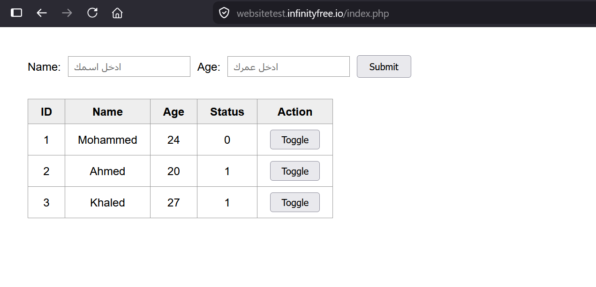
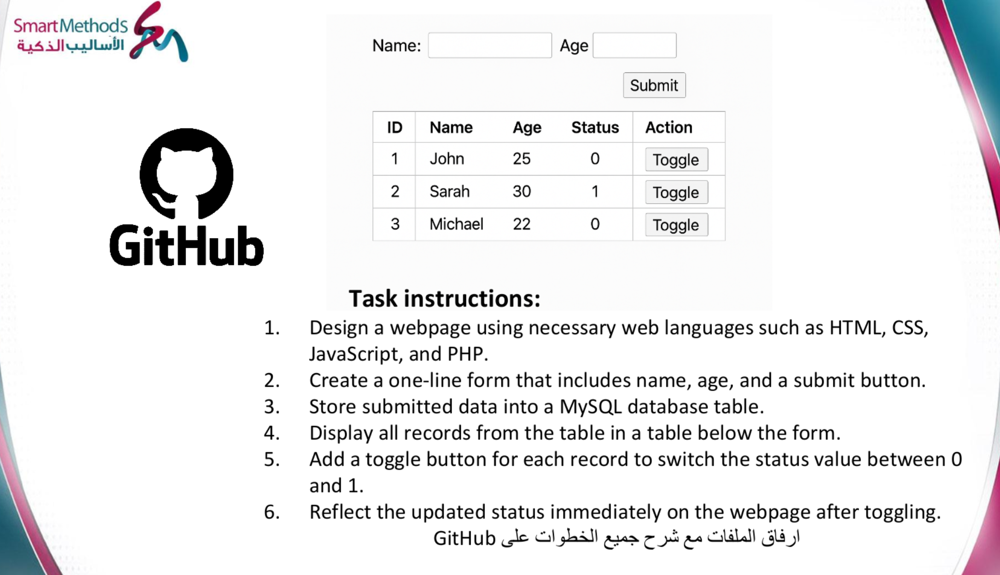
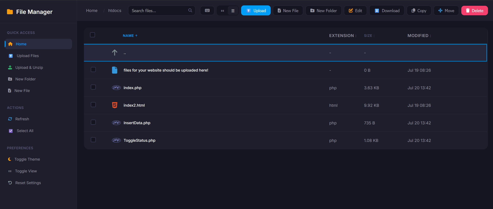

# ST-2026 · PHP Form Records

A PHP + MySQL web page: submit a **name** and **age** through a one-line form, store them in a MySQL database, and list every record in a table below the form. Application task of the Smart Methods (ST 2026) summer training.



> 🔗 **Live site:** https://websitetest.infinityfree.io
> *(hosted free on [InfinityFree](https://infinityfree.com) — the first load runs a JavaScript bot-check and reloads the page with `?i=1`. If you get a blank white page, hard-refresh with `Ctrl+Shift+R` or disable your ad blocker for the domain — an ad blocker stops that script and the page never appears.)*

---

## 1. The task

From the Smart Methods brief:

| # | Requirement | Status |
|---|---|---|
| 1 | Design a webpage using necessary web languages such as HTML, CSS, JavaScript and PHP | ✅ HTML + CSS + PHP |
| 2 | Create a **one-line** form that includes name, age and a submit button | ✅ done |
| 3 | Store the submitted data into a MySQL database table | ✅ done |
| 4 | Display all records from the table in a table below the form | ✅ done |

The target layout — a one-line form, with the records table underneath:



---

## 2. How it works

Two PHP files and one database table:

```
                  ┌──────────────────────────────┐
                  │  index.php                   │
   browser  ────▶ │  · the one-line form         │
                  │  · SELECT → records table    │
                  └──────────────┬───────────────┘
                                 │ submit (POST)
                                 ▼
                  ┌──────────────────────────────┐
                  │  InsertData.php              │
                  │  · INSERT into MyGuests      │
                  │  · redirect back to index    │
                  └──────────────┬───────────────┘
                                 │
                                 ▼
                        MySQL · MyGuests
```

Submitting the form sends the values to `InsertData.php`, which writes the row and redirects straight back to `index.php`. Because `index.php` re-runs its `SELECT` on every load, the new record is already in the table when the page comes back.

### Why the form page is `index.php` and not `page.html`

A `.html` file is sent to the browser exactly as written — the server never runs any code inside it, so it cannot talk to MySQL. Since step 4 requires the records table to sit **below the form on the same page**, that page has to be `.php`. Naming it `index.php` also makes it the site's default page, so `websitetest.infinityfree.io` opens it with no filename needed.

---

## 3. The database

The table is `MyGuests`, in the database `if0_42446707_myfrist`:

| Column | Type | Notes |
|---|---|---|
| `id` | `INT AUTO_INCREMENT` | primary key — MySQL assigns it, never sent by the form |
| `name` | `VARCHAR(30)` | from the form |
| `age` | `INT(3)` | from the form |
| `status` | `TINYINT(1)` | defaults to `0` on insert |

Full SQL is in [`schema.sql`](schema.sql). Run it once in **phpMyAdmin** (InfinityFree panel → *MySQL Databases* → *Admin*) before using the page — the `status` column has to exist or both PHP files will error.

---

## 4. Building it

### The one-line form (step 2)

A default HTML form stacks its fields vertically. CSS flexbox puts them on a single row:

```css
form {
  display: flex;
  align-items: center;
  gap: 10px;
}
```

### Reading the records back (step 4)

The `SELECT` runs at the top of `index.php`, before any HTML is sent, then `while ($row = $result->fetch_assoc())` prints one `<tr>` per record:

```php
$sql = "SELECT id, name, age, status FROM MyGuests ORDER BY id";
$result = $conn->query($sql);
```

### Hosting

All files are uploaded through the InfinityFree **File Manager** into `htdocs/`, which is the web root for the domain.



---

## 5. Notes & trade-offs

Known rough edges, listed honestly rather than hidden:

- **The credentials are written directly in both PHP files.** Deliberate — this is a throwaway demo database on free hosting, and the task is about showing the code plainly. A production project would keep them in a separate file excluded from git, or in environment variables.
- **The SQL is built by string interpolation**, so it is open to SQL injection. The correct fix is `$conn->prepare()` with bound parameters.
- **No input validation** — submitting the form empty inserts an empty row.
- **The credentials are repeated in both files**, so changing the password means editing two places.
- **No toggle button.** Steps 5 and 6 of the original brief (a per-row button switching `status` between `0` and `1`, reflected immediately) are out of scope here — but the `status` column exists and is displayed, ready for them.

---

## Repository contents

| File | What it is |
|---|---|
| [`index.php`](index.php) | the form + the records table below it |
| [`InsertData.php`](InsertData.php) | receives the submit and inserts the row |
| [`schema.sql`](schema.sql) | SQL to create the table / add the `status` column |
| `docs/` | screenshots used in this README |

---

## Key specs

| | |
|---|---|
| Stack | HTML · CSS · PHP 8 · MySQL (MariaDB) |
| Host | InfinityFree — `websitetest.infinityfree.io` |
| Web root | `htdocs/` |
| Database | `if0_42446707_myfrist` |
| Table | `MyGuests` — `id`, `name`, `age`, `status` |

---

## Credits & references

- **Task brief** — Smart Methods (الأساليب الذكية) ST 2026 summer training
- **Hosting & MySQL** — [InfinityFree](https://infinityfree.com)
- **PHP/MySQL reference** — W3Schools, [Insert Data](https://www.w3schools.com/php/php_mysql_insert.asp) and [Select Data](https://www.w3schools.com/php/php_mysql_select.asp)
