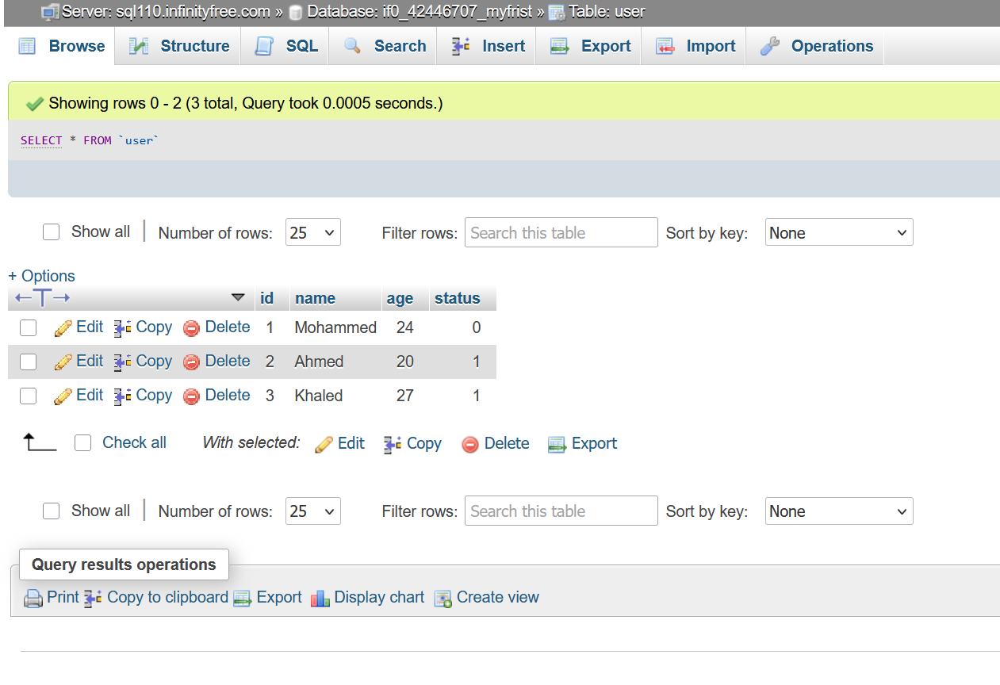
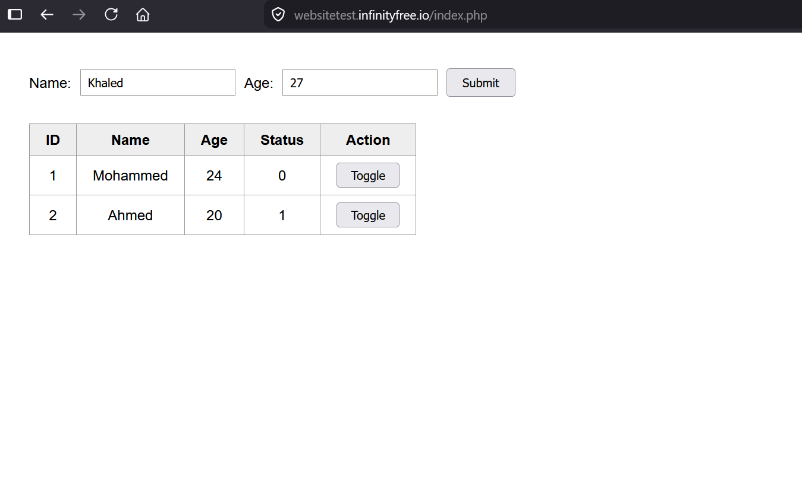
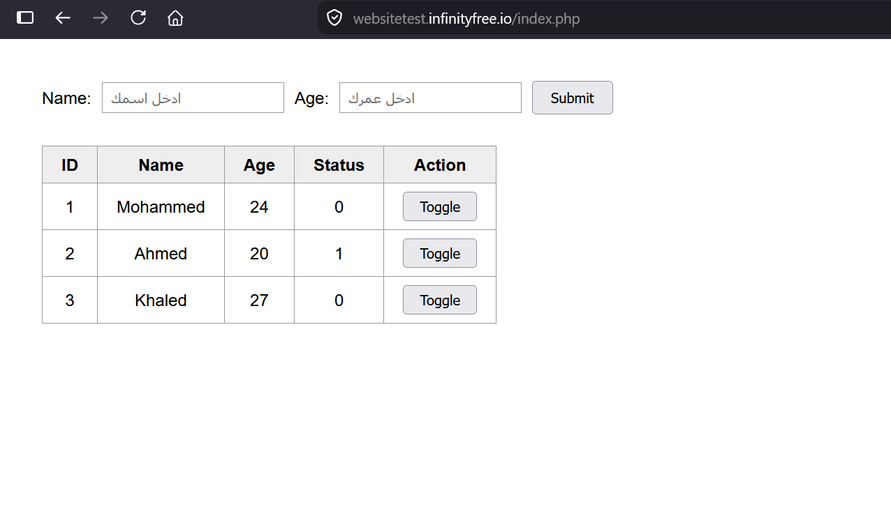

# ST-2026 · PHP Form Records

A PHP + MySQL web page: submit a **name** and **age** through a one-line form, store them in a MySQL database, list every record in a table below the form, and flip any record's status between `0` and `1` with a toggle button — updating instantly, without reloading the page. Application task of the Smart Methods (ST 2026) summer training.


> 🔗 **Live page:** **https://websitetest.infinityfree.io/index.php**
> *(`https://websitetest.infinityfree.io` on its own works too — `index.php` is the default document)*
> *(hosted free on [InfinityFree](https://infinityfree.com) — the first load runs a JavaScript bot-check and reloads the page with `?i=1`. If you get a blank white page, hard-refresh with `Ctrl+Shift+R` or disable your ad blocker for the domain — an ad blocker stops that script and the page never appears.)*

---

## 1. The task

From the Smart Methods brief:

| # | Requirement | Where it lives |
|---|---|---|
| 1 | Design a webpage using necessary web languages such as HTML, CSS, JavaScript and PHP | all four, in `index.php` |
| 2 | Create a **one-line** form that includes name, age and a submit button | `index.php` — CSS flexbox |
| 3 | Store the submitted data into a MySQL database table | `InsertData.php` |
| 4 | Display all records from the table in a table below the form | `index.php` — `SELECT` + `while` loop |
| 5 | Add a toggle button for each record to switch the status value between `0` and `1` | button in `index.php`, update in `ToggleStatus.php` |
| 6 | Reflect the updated status immediately on the webpage after toggling | `index.php` — `fetch()`, no reload |

---

## 2. How it works

Three PHP files and one database table:

```
                  ┌──────────────────────────────┐
                  │  index.php                   │
   browser  ────▶ │  · the one-line form         │
                  │  · SELECT → records table    │
                  │  · JavaScript for the toggle │
                  └───────┬──────────────┬───────┘
                          │              │
             submit(POST) │              │ click Toggle
                          ▼              ▼      (fetch, no reload)
        ┌──────────────────────┐  ┌──────────────────────┐
        │  InsertData.php      │  │  ToggleStatus.php    │
        │  · INSERT a row      │  │  · UPDATE the status │
        │  · redirect back     │  │  · reply with JSON   │
        └──────────┬───────────┘  └──────────┬───────────┘
                   │                         │
                   └────────────┬────────────┘
                                ▼
                          MySQL · `user`
```

**Submitting** sends the values to `InsertData.php`, which writes the row and redirects straight back to `index.php`. Since `index.php` re-runs its `SELECT` on every load, the new record is already there when the page returns.

**Toggling** never reloads. JavaScript posts just the row's `id` to `ToggleStatus.php`, which flips the value in MySQL and replies with the new one. The script then rewrites that single table cell — so the change is visible immediately, and the rest of the page (including anything typed in the form) is untouched.

### Why the page is `index.php` and not `page.html`

A `.html` file is sent to the browser exactly as written — the server never runs code inside it, so it cannot talk to MySQL. Since step 4 requires the records table to sit **below the form on the same page**, that page must be `.php`. Naming it `index.php` also makes it the site's default document, so `websitetest.infinityfree.io` opens it with no filename needed.

Note this does **not** mean giving up HTML: most of `index.php` is plain HTML and CSS. The `.php` extension only tells the server to run the `<?php ... ?>` sections first and paste their output into the HTML around them.

---

## 3. The database

The table is `user`, in the database `if0_42446707_myfrist`:

| Column | Type | Notes |
|---|---|---|
| `id` | `INT(11) AUTO_INCREMENT` | primary key — MySQL assigns it, never sent by the form |
| `name` | `VARCHAR(255)` | from the form |
| `age` | `INT(11)` | from the form |
| `status` | `TINYINT(1)` | added by `schema.sql`; defaults to `0`, toggled to `1` and back |

`user` is written in **backticks** in every query — `` `user` `` — because `USER` is a reserved word in MySQL and the query fails without them. phpMyAdmin does the same thing when it generates a query for this table.

Full SQL is in [`schema.sql`](schema.sql). The `status` column must exist before the page will work:

```sql
ALTER TABLE `user` ADD status TINYINT(1) NOT NULL DEFAULT 0;
```

The same records, seen directly in phpMyAdmin — this is what the web page is reading:



---

## 4. Building it

### The one-line form (step 2)

A default HTML form stacks its fields vertically. CSS flexbox puts them on a single row:

```css
form {
  display: flex;
  align-items: center;
  gap: 10px;
}
```

### Reading the records back (step 4)

The `SELECT` runs at the top of `index.php`, before any HTML is sent, then `while ($row = $result->fetch_assoc())` prints one `<tr>` per record:

```php
$sql = "SELECT id, name, age, status FROM `user` ORDER BY id";
$result = $conn->query($sql);
```

### Flipping the status (step 5)

The whole toggle is one SQL statement. `1 - status` turns `0` into `1` and `1` into `0` arithmetically, inside MySQL — so the old value never has to be read into PHP first:

```php
$sql = "UPDATE `user` SET status = 1 - status WHERE id = '$id'";
```

### Showing it immediately (step 6)

`ToggleStatus.php` replies with JSON rather than a web page:

```json
{ "ok": true, "status": "1" }
```

(`status` comes back as a string — mysqli returns column values as strings unless native types are enabled. It is written straight into the cell as text, so this makes no difference here.)

JavaScript in `index.php` sends the click, waits for that reply, and rewrites only the one cell it belongs to:

```js
fetch('ToggleStatus.php', {
  method: 'POST',
  headers: { 'Content-Type': 'application/x-www-form-urlencoded' },
  body: 'id=' + encodeURIComponent(id)
})
  .then(response => response.json())
  .then(data => {
    document.getElementById('status-' + id).textContent = data.status;
  });
```

The `Content-Type` header is not optional. Without it PHP never fills `$_POST`, so `ToggleStatus.php` would receive no id at all.

Each status cell carries `id="status-<record id>"`, which is how the script finds the right one. The value written to the page is the value read back **from the database**, not a guess made in the browser — so what you see is always what is actually stored.

### Hosting

All three PHP files are uploaded through the InfinityFree **File Manager** into `htdocs/`, the web root for the domain.


---

## The result

Filling in the form — `Khaled`, `27` — with two records already stored:



After submitting, `InsertData.php` redirects back and the new record is row 3, with `status` defaulting to `0`, then toggled to `1`:


Clicking **Toggle** on row 3 flips it straight back to `0` — the cell changes on its own, with no page reload and nothing else on the page moving:



---

## 5. Notes & trade-offs

Known rough edges, listed honestly rather than hidden:

- **The credentials are written directly in all three PHP files.** Deliberate — this is a throwaway demo database on free hosting and the task is about showing the code plainly. A production project would keep them in one separate file excluded from git, or in environment variables. It also means changing the password requires editing three places.
- **The SQL is built by string interpolation**, so it is open to SQL injection. The correct fix is `$conn->prepare()` with bound parameters.
- **No input validation** — submitting the form with both fields blank still inserts an empty row. (Opening `InsertData.php` directly no longer does: it now checks for a real POST and bounces back to the form.)
- **Output *is* escaped.** Names are passed through `htmlspecialchars()` before being printed into the table, so a name containing `<` or `>` cannot break the table layout or run as script. This is separate from the SQL point above — that one concerns data going *in*, this one data coming *out*.
- **No delete or edit.** Records can only be added and toggled, which is all the brief asks for.
- **The toggle needs JavaScript.** With JS disabled the table still displays correctly, but the button does nothing.

---

## Repository contents

| File | What it is |
|---|---|
| [`index.php`](index.php) | the form, the records table, and the toggle JavaScript |
| [`InsertData.php`](InsertData.php) | receives the submit and inserts the row |
| [`ToggleStatus.php`](ToggleStatus.php) | flips one record's status, replies with JSON |
| [`schema.sql`](schema.sql) | SQL to add the `status` column |
| `docs/` | screenshots used in this README |

---

## Key specs

| | |
|---|---|
| Stack | HTML · CSS · JavaScript · PHP 8 · MySQL (MariaDB) |
| Host | InfinityFree — `websitetest.infinityfree.io` |
| Web root | `htdocs/` |
| Database | `if0_42446707_myfrist` |
| Table | `user` — `id`, `name`, `age`, `status` |

---

## Credits & references

- **Task brief** — Smart Methods (الأساليب الذكية) ST 2026 summer training
- **Hosting & MySQL** — [InfinityFree](https://infinityfree.com)
- **PHP/MySQL reference** — W3Schools, [Insert Data](https://www.w3schools.com/php/php_mysql_insert.asp) and [Select Data](https://www.w3schools.com/php/php_mysql_select.asp)
